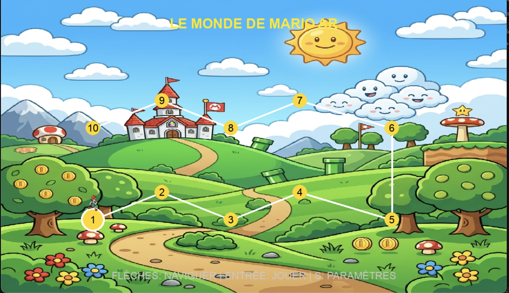
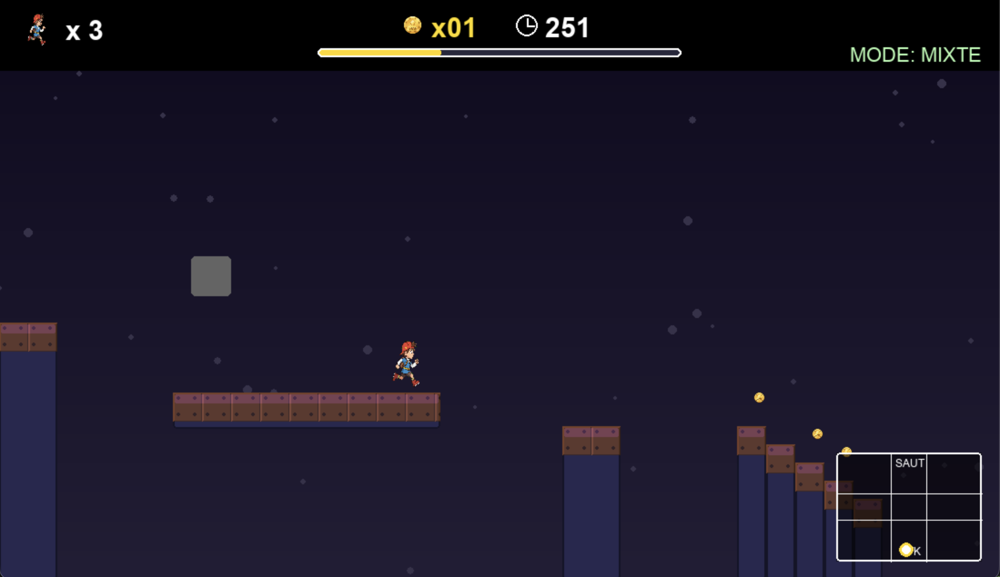
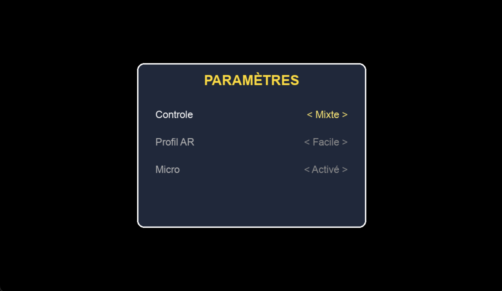

# 2D Platform Games For Disabilities (MiniMarioAR)

**MiniMarioAR** est un jeu de plateforme 2D expérimental conçu pour briser les barrières de l'interaction numérique. Le projet explore comment les technologies de vision par ordinateur (AR) et de reconnaissance vocale peuvent offrir une expérience de jeu complète aux personnes en situation de handicap moteur ou à mobilité réduite.

## 🌟 Vision & Inclusion
L'objectif de ce projet est de démontrer que le jeu vidéo peut être universel. En remplaçant ou en complétant les contrôles clavier traditionnels par des commandes naturelles, MiniMarioAR permet à chacun de s'immerger dans un univers ludique, quel que soit son degré de mobilité.

## 🛠 Fonctionnalités d'Accessibilité

### 1. Contrôle Vocal Intégral (Hands-Free)
Le joueur peut piloter l'ensemble du jeu sans aucun contact physique. Le moteur utilise la reconnaissance vocale de Google pour une précision optimale.

| Action | Commande Vocale (FR) |
| :--- | :--- |
| **Lancer le jeu** | "Jouer" |
| **Navigation** | "Menu", "Paramètres" ou "Settings" |
| **Gestion de session** | "Pause", "Reprendre", "Rejouer" |
| **Choix du niveau** | "Niveau 1" à "Niveau 10" |
| **Modes de contrôle** | "Mode Mixte", "Mode Clavier", "Mode Caméra" |
| **Quitter** | "Quitter" |

### 2. Contrôle par Gestes AR (Spatial Interface)

La webcam suit la position de votre main (ou d'un index/moignon) en temps réel.
- **Interface Spatiale** : L'écran est divisé en zones. Pointer vers le haut déclenche un saut, vers le bas une attaque.
- **Radar AR** : Un moniteur discret vous montre en permanence ce que la caméra voit.

### 3. Paramètres Personnalisés

Quatre profils de sensibilité (**Facile, Normal, Dur, Spécial**) permettent d'ajuster le jeu à l'amplitude de mouvement de chaque utilisateur.

## 🎮 Contrôles Classiques (Clavier)
| Action | Touche |
| :--- | :--- |
| **Déplacement** | Flèches Gauche / Droite (ou Q/D) |
| **Saut** | Flèche Haut / Espace (ou Z) |
| **Attaque** | Touche S |
| **Menu / Pause** | Touches S / P / M |

## 🚀 Installation & Lancement

> [!IMPORTANT]
> Une connexion internet est requise pour la reconnaissance vocale (Google Web API).

### Lancement direct
1. Téléchargez l'archive correspondant à votre système.
2. **macOS** : Lancez `MiniMarioAR.app`. Si macOS bloque l'ouverture, allez dans *Réglages Système > Confidentialité et sécurité* et cliquez sur **"Ouvrir quand même"**.
3. **Windows** : Lancez `MiniMarioAR.exe`.

## 🏗 Build Multi-Plateforme
Tapez la commande correspondante dans un terminal **Bash** :

| OS | Commande | Note |
| :--- | :--- | :--- |
| **macOS** | `./build_macos.sh` | Génère un `.app` |
| **Windows** | `./build_windows.sh` | Utilisez **Git Bash** |
| **Linux** | `./build_linux.sh` | Génère un binaire ELF |

## ❓ Dépannage (Troubleshooting)
> [!TIP]
> - **Caméra non détectée** : Assurez-vous qu'aucune autre application n'utilise la webcam. Sur macOS, vérifiez les autorisations dans Sécurité.
> - **Lenteur vocale** : La reconnaissance dépend de la qualité de votre connexion internet et de la clarté du micro.
> - **Détection AR instable** : Essayez de vous placer dans un endroit bien éclairé avec un fond uniforme.

---
*Projet réalisé avec un engagement pour l'accessibilité numérique.*
